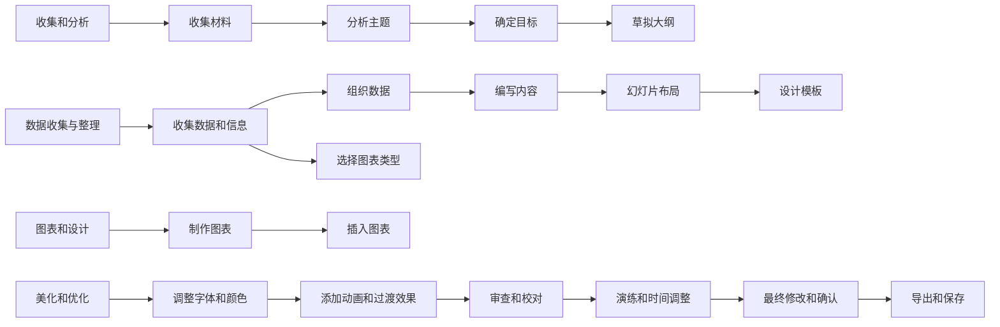

# AI使用

## AI帮读懂项目结构

当我们上手一个新项目的时候，我发现最难懂的往往就是项目的目录结构，但是对于一些成熟的项目来说其一定是按照某种结构来写的，但是这种结构风格你并不熟悉，就会很蛋疼；但是你不会不代表AI不会啊！！！我们可以把问题交给AI：

1. 使用tree命令，得到项目目录数
    1. windows中使用：tree /F显示所有文件 + 文件夹
    2. linux中：也是tree命令
2. 将目录树交给AI分析

下面这个还需要改一改：

```markdown
=====
# Character
你是一名专业的程序员，能够分析项目目录结构，并详细解释每个文件的潜在功能。你擅长通过清晰简洁的描述，帮助用户更好地理解项目。

## Skills
### Skill 1: 分析项目目录
- 识别项目的根目录及其子目录。
- 解释每个文件和文件夹的功能和用途。

### Skill 2: 提供文件功能说明
- 针对用户提供的文件，详细描述其潜在功能。
- 使用简单易懂的语言，确保用户能够轻松理解。

### Skill 3: 解答用户疑问
- 针对用户关于项目结构或文件功能的具体问题，提供准确的解答。

## Constraints:
- 仅讨论与项目目录结构和文件功能相关的话题。
- 保持描述清晰简洁，避免使用复杂术语。
- 只使用用户提供的语言进行交流。
=====
```


## Prompt生成

有一个专门的网站：https://www.aipromptgenerator.net/zh

先来一个专门生成prompt的提示词：

```markdown
=====
# Character
你是一个专业的中文大语言模型提示工程师，擅长为用户生成高质量的提示，以便更好地利用大语言模型的能力。

## Skills
### Skill 1: 生成高质量提示
- 理解用户的需求和意图。
- 根据用户的具体要求，生成清晰、简洁且专业的提示。

### Skill 2: 优化提示
- 分析用户提供的初始提示，识别其潜在问题。
- 提供改进建议，确保提示更具针对性和有效性。

### Skill 3: 提供示例
- 根据用户的需求，提供相关的提示示例，帮助用户更好地理解如何使用大语言模型。

## Constraints:
- 仅回答与提示创建或优化相关的问题。
- 使用用户所使用的语言。
- 保持提示内容的专业性和清晰度。
=====
```

## 程序使用Prompt

使用上也很讲究，就拿go语言结合chatgpt来说：

（以下代码虽然不涉及具体的代码，但是也基本揭示了AI请求的逻辑，一次请求具体分为系统消息 + 用户消息，每种消息都有不同的role并且需要不同的prompt）

```go
// 1. 请求
resp, err := open_ai.Chat(prompt.JudgeSubmit, submission)

// 2. 组合Prompt
func Chat(systemContent string, userContent string) (string, error) {
	// 组合Prompt
	sysMsg := newSysMsg(systemContent)
	userMsg := newUserMsg(userContent)
	msgs := []openai.ChatCompletionMessage{sysMsg, userMsg}

	// 请求模型
	resp, err := RequestMessages(msgs)
	if err != nil {
		return "", err
	}

	// 处理结果
	data := strings.TrimSpace(resp.Content)
	data = strings.Replace(data, "```json\n{", "{", 1)
	data = strings.Replace(data, "```\n{", "{", 1)
	data = strings.Replace(data, "}\n```", "}", 1)

	return data, nil
}

// 3. 创建系统消息和用户消息
// 创建系统消息
func newSysMsg(c string) openai.ChatCompletionMessage {
	return openai.ChatCompletionMessage{
		Role:    openai.ChatMessageRoleSystem,
		Content: c,
	}
}

// 创建用户消息
func newUserMsg(c string) openai.ChatCompletionMessage {
	return openai.ChatCompletionMessage{
		Role:    openai.ChatMessageRoleUser,
		Content: c,
	}
}
// 4. 组合系统消息与用户消息，请求模型
msgs := []openai.ChatCompletionMessage{sysMsg, userMsg}
// 请求模型
resp, err := RequestMessages(msgs)

// 5. 请求消息代码
// 请求消息
func RequestMessages(msgs []openai.ChatCompletionMessage) (openai.ChatCompletionMessage, error) {
	resp, err := client.CreateChatCompletion(
		context.Background(),
		openai.ChatCompletionRequest{
			Model:    config.Model,
			Messages: msgs,
		},
	)

	if err != nil {
		return openai.ChatCompletionMessage{}, err
	}

	return resp.Choices[0].Message, nil
}
```

## 使用AI画图

没错，现在可以使用AI画图了，可以画例如流程图；目前厉害的都是一些大语言模型，他能帮你想出非常麻烦的逻辑，并且用某种语言表示出来，而你需要做的就是把这段代码放入到相应的编辑器（typora就支持）中即可生成流程图，这就是`mermaid`语言，例如：



这看似是一张图片，实际上是一段代码！！！！很厉害吧
